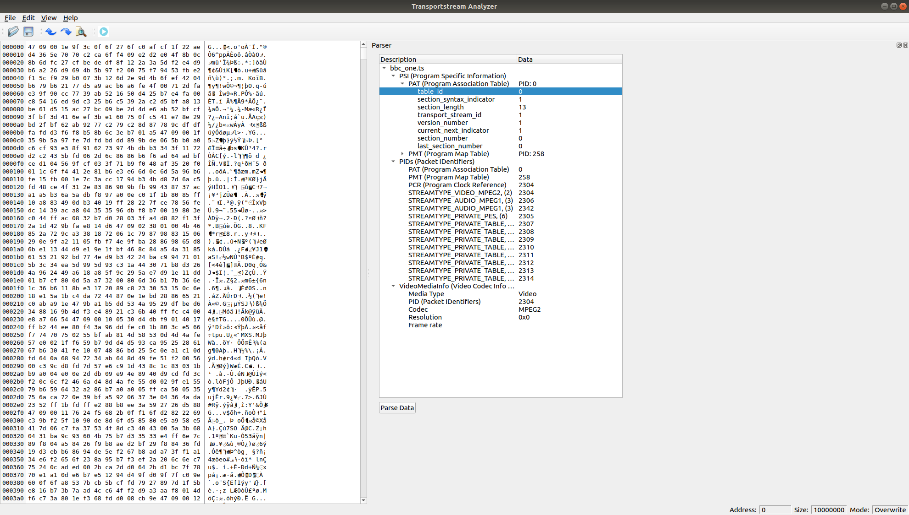

# ts-analyzer

Visualize content of a transport stream.

## How to run it
Install Qt Creator or Qt SDK and open the ts-analyzer.pro project file.
From the Qt Creator IDE you can now edit this project.

Alternatively it's possible building via commandline (requires Qt SDK):
    
    qmake
    make
    ./ts-analyzer

This image shows the GUI of ts-analyzer app:

## License
This app is GNU GPL v2.1:

    Copyright © 2018-2020  kohnech

    This library is free software; you can redistribute it
    and/or modify it under the terms of the GNU Lesser General
    Public License as published by the Free Software Foundation;
    either version 2.1 of the License, or (at your option) any 
    later version.

    This library is distributed in the hope that it will be 
    useful, but WITHOUT ANY WARRANTY; without even the implied 
    warranty of MERCHANTABILITY or FITNESS FOR A PARTICULAR 
    PURPOSE.  See the GNU Lesser General Public License for more 
    details.

    You should have received a copy of the GNU Lesser General 
    Public License along with this library; if not, write to the 
    Free Software Foundation, Inc., 51 Franklin Street, Fifth 
    Floor, Boston, MA  02110-1301  USA

## Dependencies
This app uses 2 3rd-party libs:

* [QHexEdit2](https://github.com/Simsys/qhexedit2) (Direct compiled and same license inherited since GNU GPL v2.1).
* [mpeg2ts](https://github.com/skullanbones/mpeg2ts) (Dynamically linked, GNU GPL 2)